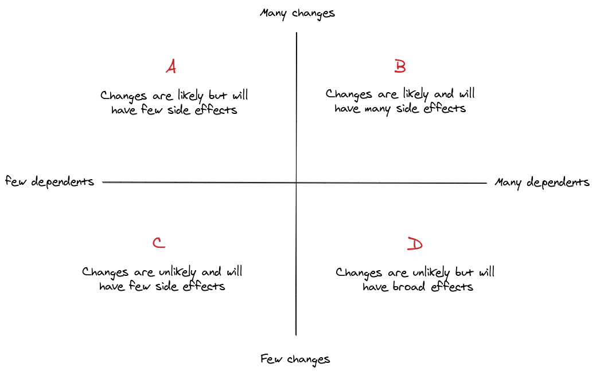

At [Factorial](https://factorialhr.com/), we maintain an engineering Handbook
where we document aspects such as common abstractions, programming principles
and documentation of our architecture.

Among these, there are a set of aphorisms stemming from coding best practices
and common pitfalls we have been encountering during the last 4 years building
our product. Let's share some of these.

Beware, these aphorisms are language-agnostic and, thus, you might find them
more or less regularly in your day to day depending on the characteristics of
your preferred programming language.

## Depend on contracts rather than data structures

This is my personal favorite because it's so simple yet so ubiquitous. Put
bluntly, data structures make for lousy interfaces: they are often opaque,
mutable and nullable, all characteristics you wouldn't want for an interface —
and yet we use them as such constantly.

The most common example is accepting a hash as a method argument:

```ruby
def method(hash)
  puts hash[:foo][:bar] # This can print something, null or raise an unexpected error.
end
```

*NOTE: This is especially prevalent in languages that make it easier to work
with data structures and nullables such as Ruby or Javascript.*

Using a data structure introduces an implicit dependency between your method and
the data structure's shape, a dependency that could have been easily avoided by
simply passing the expected value:

```ruby
def method(bar: nil)
  puts bar # This can print something or null
end
```

In cases where the dependency with the data structure cannot be avoided, isolate
it behind an accessor service:

```ruby
def method(hash)
  puts HashAccessor.new(hash).get(:bar) # This can print something or null
end

class HashAccessor
  def initialize(hash)
    @hash = hash
  end

  def get(attr)
    # ...
  end
end
```

Although this might come across as a superfluous refactor it minimizes the
spread of the dependency and paves the way for a future refactor in which we
would get rid of this data structure dependency altogether.

## Avoid null values

Hardly a surprise. All the new [cool kids](https://www.rust-lang.org/) in the
block are using it.

The problem with null values was already hinted at in the previous aphorism:
it's a very hard contract to enforce. This will result in errors happening far
away from the underlying issue:

```ruby
# main.rb
ROLES = { admin: 'admin', manager: 'manager' }
role = ROLES[user.role]
user_presenter(role)

# user_presenter.rb
def user_presenter(role)
  return 'Admin' if role == ROLES[:admin]

  ManagerRolePresenter.render(role)
end

# manager_role_presenter.rb
def manager_role_presenter(role)
  "#{role.capitalize} – Lead" # << Unexpected `capitalize` message for `nil`! This is very far from the origin of the `nil` and hard to fix
end
```

To avoid null values you can enforce types (if your language supports it),
implement the [optional pattern](https://doc.rust-lang.org/std/option/), use a
custom contract with data validation (such as a Struct) or directly raise an
exception closer to the null source.

## Code should be *greppable*

Or, put another way, do not be too smart for your own good.

As a rule of thumb, your teammates should be able to easily navigate your code
using only a pattern-matching tool like `grep` (or `ctrl-f` for those using
fancier editors).

If that weren't the case it probably means your code is not explicit enough and
is hiding dependencies with dangerous techniques like meta-programming:

```ruby
module Jon
  class Snow
    # ...
  end
end

# main.rb
  def main
    "Jon::#{name}".constantize.new # This can blow up
  end
```

As if the potential error wasn't bad enough, this technique obfuscates the
author's intention and makes navigating your code more difficult than necessary.

To avoid these pitfalls and improve code quality make extensive use of [static
analysis
tools](https://en.wikipedia.org/wiki/List_of_tools_for_static_code_analysis)
such as linters or static type analysis.

In the particular case of meta-programming, replace it with a good ol' Map or
switch statement.

## Depend on abstractions rather concretions

Lastly, a general principle. If you take a look at most of our previous examples
and their proposed solutions, they all share a common property: the solution
implements an abstraction.

Do not depend on data structures, depend on an abstraction that gives you access
to the underlying data. Do not depend on nullable values, depend on an
abstraction that handles the nullable state for you... You can see the pattern.

The advantage of abstractions over concretions is that they change less often,
and this is good for code maintainability:



You often cannot control the amount of changes over time, but you can control
the number of dependencies. Stay away from zone B and you will be fine.

That's it! We hope you will find some useful tips from this list that you can
put to good use in your daily coding practice.

Cheers.
